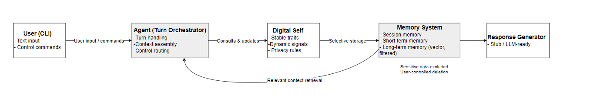
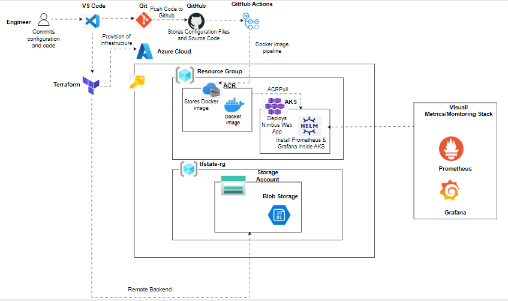

<!-- ======================= -->
<!-- 🔥 HERO SECTION -->
<!-- ======================= -->

<h1 align="center">🤖 Oluwaseyi Bello</h1>

  <b>AI Engineer · MLOps · Intelligent Systems</b>

  Building stateful AI systems, secure AI backends, and scalable ML infrastructure

  
  
  

---

# 🧠 Featured AI Systems

---

## 🧠 Digital Self Memory & Personalisation Engine  
🔗 https://github.com/seyiabello/Digital-Self-Memory-Personalisation-Engine  

  

<i>Architecture: Layered memory + Digital Self orchestration</i>

**Stateful AI system enabling persistent, privacy-aware personalisation.**

### 🔑 Key Capabilities
- Layered memory architecture (Session · STM · LTM)  
- Vector memory with embedding-based retrieval (Chroma)  
- Structured **Digital Self representation**  
- Explicit forgetting + privacy constraints  
- Transparent retrieval logging (explainable AI)

### 🧠 Why this stands out
- Solves a core limitation of modern AI: **stateless interactions**
- Demonstrates **true AI system design (not just model usage)**

---

## 🧠 Human-Centred AI Triage System  
🔗 https://github.com/seyiabello/HCAI-Triage-A-Human-Centred-AI-System-for-Remote-Primary-Care-Early-Warning  

**Clinician-in-the-loop AI system for safe and explainable healthcare decision support.**

- Multimodal data fusion  
- Uncertainty-aware prediction (GBDT + Bayesian updates)  
- Sequential decision-making (POMDP-inspired)  
- Explainable outputs + human override  
- Safety-first deployment mindset  

👉 Focus: **trust, safety, real-world AI systems**

---

## 🤖 Secure AI Chatbot (Production Backend)  
🔗 https://github.com/seyiabello/secure-chatbot-demo  

  

<i>Architecture: Secure LLM pipeline with guardrails, resilience, and logging</i>

**Production-style AI service demonstrating deployment, security, and backend engineering.**

- FastAPI inference API  
- Dockerised deployment  
- Input/output validation & security controls  
- Pytest-based testing  
- Guardrails-ready architecture  

👉 Shows ability to **ship AI systems end-to-end**

---

## 📊 Amazon Review Sentiment Analysis  
🔗 https://github.com/seyiabello/Amazon-Review-Sentiment-Analysis  

**End-to-end NLP pipeline with feature engineering and evaluation.**

- TF-IDF, LDA, PCA  
- Models: Logistic Regression, SVM, MLP  
- Accuracy: **0.832**  
- Full evaluation pipeline  

👉 Demonstrates **ML experimentation + modelling**

---

# ⚙️ AI Infrastructure & MLOps

---

## 🏗️ Nimbus DevOps Platform  
🔗 https://github.com/seyiabello/End-to-end-devops-project-nimbus-infra  

  

<i>End-to-end cloud DevOps pipeline with CI/CD, AKS, and monitoring</i>

- CI/CD (GitHub Actions)  
- Docker → Kubernetes deployment  
- Prometheus + Grafana monitoring  

👉 Foundation for **production AI systems**

---

## 🔭 Monitoring with Prometheus & Grafana  
🔗 https://github.com/seyiabello/Monitoring-with-Prometheus-Grafana  

**Production-style Kubernetes observability stack deployed on AKS.**

- Prometheus metric scraping for cluster workloads  
- Grafana dashboards for CPU, memory, networking, and storage  
- Helm-based deployment (kube-prometheus-stack)  
- Bash automation for reproducible setup  

👉 Demonstrates **observability engineering for cloud-native systems**

---

## 🌩️ Azure Network Architecture (Hub–Spoke)  
🔗 https://github.com/seyiabello/azure-fundamentals-capstone  

  

<i>Secure hub–spoke architecture with Bastion, Key Vault, and private networking</i>

- Hub–spoke VNet design  
- Private endpoints + no public SSH  
- Key Vault + managed identity integration  

---

## 🌩️ Azure Terraform Infrastructure  
🔗 https://github.com/seyiabello/azure-terraform-infra  

- Modular Terraform IaC  
- AKS + ACR integration  
- Managed identities + Key Vault  
- Remote state backend  

---

## ☸️ Kubernetes Deployment  
🔗 https://github.com/seyiabello/Deploying-to-Kubernetes-Cluster  

- Scalable container orchestration  
- Deployment strategies  

---

## 🔁 CI/CD Automation  
🔗 https://github.com/seyiabello/CI-CD-Pipeline---Automating-Build-and-Deployment  

- Automated pipelines  
- Reproducible workflows  

---

# 🧪 Research & Data Science

---

## 📘 AI Tools & Student Performance (Data Science Project)  
🔗 https://github.com/seyiabello/Data-Science-Project-Does-Using-ChatGPT-or-AI-Tools-Improve-Student-Performance  

**Research-driven data science project exploring AI usage and student outcomes.**

- Python data simulation (NumPy, pandas)  
- Exploratory data analysis and visualisation  
- Survey design and research workflow  
- Ethics, privacy, and FAIR data principles  

👉 Demonstrates **data science, research design, and responsible AI awareness**

---

# 🛡️ Security & Systems Engineering

---

## 🔒 Linux Firewall Hardening  
🔗 https://github.com/seyiabello/ubuntu-firewall-ufw  

- Least-privilege rules  
- Nmap validation  

---

## 🧪 Cybersecurity Home Lab  
🔗 https://github.com/seyiabello/cybersecurity-home-lab  

- Offensive + defensive security  
- SSH brute-force (Hydra)  
- Network analysis  

---

## 🌐 Network Traffic Analysis  
🔗 https://github.com/seyiabello/network-traffic-analysis-wireshark  

- Packet inspection  
- Protocol analysis  

---

## 🖥️ Enterprise Helpdesk Lab  
🔗 https://github.com/seyiabello/enterprise-helpdesk-lab  

- Active Directory (Users, Groups, GPOs)  
- Windows Server environment  
- IT support workflow simulation  

---

# 🧰 Tech Stack

### 🤖 AI / ML

### ⚙️ Backend

### ☁️ Cloud & MLOps

### 🛡️ Security

---

# 📌 Current Focus

- 🧠 Stateful AI systems with memory and personalisation  
- 🤖 Secure AI backends and LLM applications  
- ☁️ MLOps pipelines for production AI deployment  
- 🛡️ Responsible AI and safety-first system design  

---

# 📊 GitHub Stats

  
  

---

# 🌍 Connect

  
  

